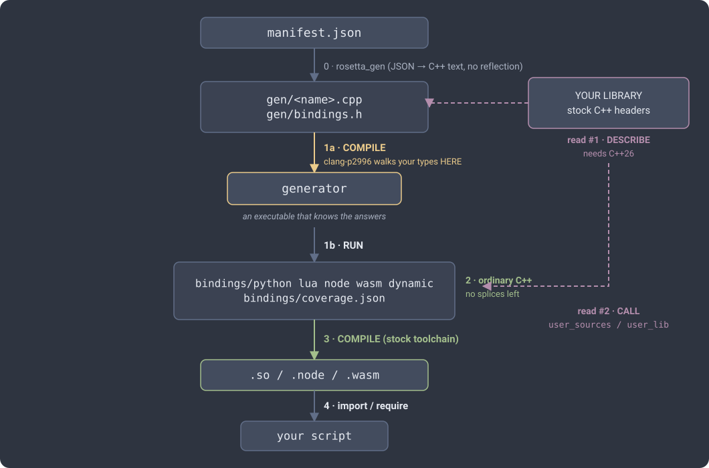
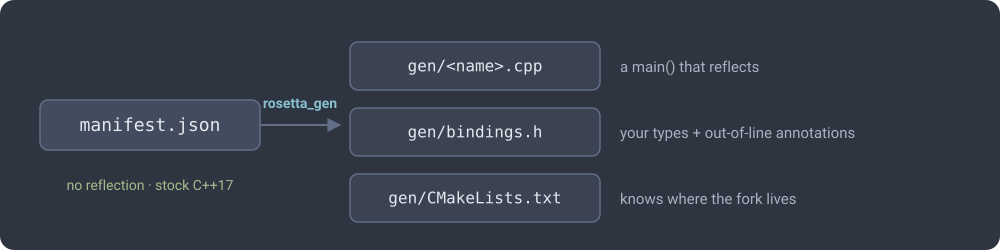
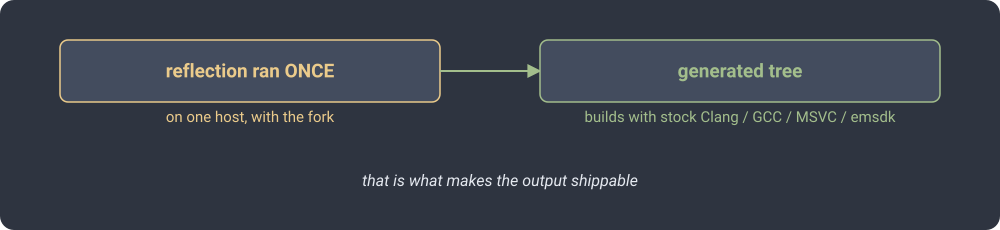
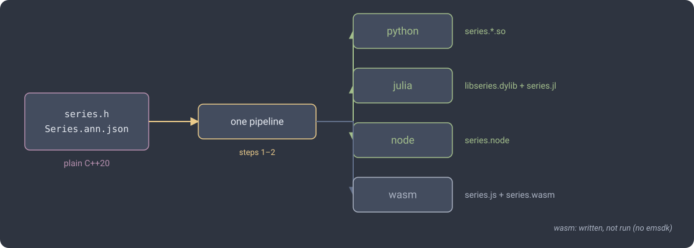
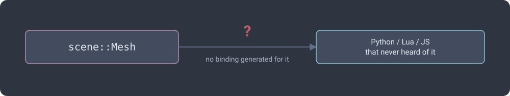
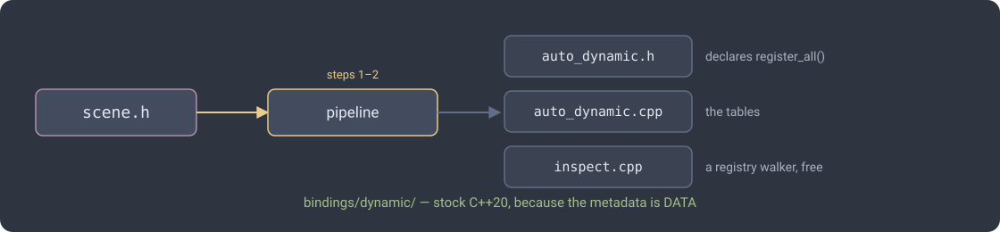
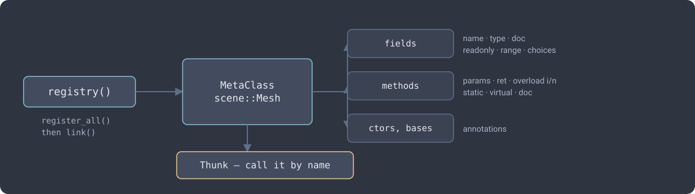
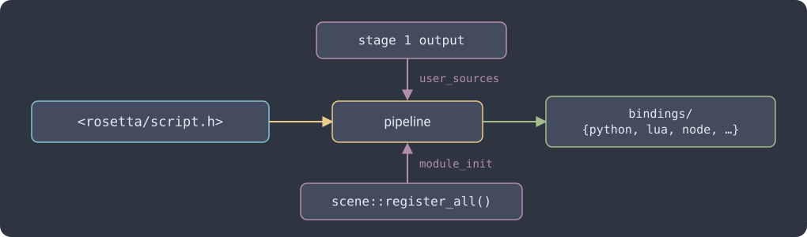
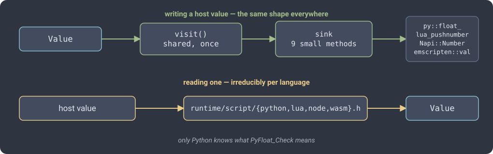
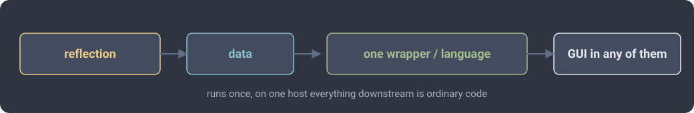

<!-- _class: lead -->


# The pipeline

### Why binding a library is a *process*, not a command.

The general shape · the base case · and the case with no binding at all.

Companion to [`docs/PIPELINE.md`](PIPELINE.md).

---

## The one constraint

C++26 reflection answers questions **at the compile time of a program that
includes your headers**.

Not from a script. Not from a config file. Not from a build system.
Only from C++, being compiled, with your types in scope.

Two consequences, and the whole pipeline follows:

- To *learn* the shape of your types, something has to **compile**.
- To *write files* from those answers, that something has to **run**.

> Compile-then-run is not a design choice. It is the only available shape.

---

<!-- _class: tight -->

## The shape



---

## Step 0 · `rosetta_gen`

A **JSON-to-C++ text templater**. No reflection. Stock C++17.



**Why it exists:** so what you write is a *manifest*, not a driver program.

**Your library:** untouched. `rosetta_gen` never opens your headers — it only
copies their names into the program it writes.

---

## Step 1 · compile *and* run the driver

```bash
rosetta_gen manifest.json gen     # emit
cmake -S gen -B gen/build         # COMPILE  ← reflection happens here
cmake --build gen/build
./generator bindings              # RUN
```

**At compile time**, clang-p2996 walks your classes, enumerates fields and
methods, reads annotations, and resolves every member against each target's
type gate. *Every bind-or-skip decision is made at this moment.*

**At run time** the driver does nothing clever — it prints the conclusions it
was compiled with.

> A compiler cannot write files. A program cannot see types it was not
> compiled against. Neither half can be skipped.

---

## Step 2 · what lands in `bindings/`

One self-contained project per target — plus `coverage.json`, a
machine-readable account of what bound and what did not, **before** anything is
compiled.

The generated code is **fully expanded**: explicit pybind11 / N-API / sol2 /
embind calls. No splices. No `<experimental/meta>`.



That is what makes the output shippable.

---

## Steps 3 & 4 · compile, load

Ordinary CMake, npm or emcmake over an ordinary C++ project.

```bash
cmake -S bindings/python -B bindings/python/build
cmake --build bindings/python/build -j
```

```python
import my_lib          # done
```

---

## Your library is read twice

| pass | by | to | needs C++26 |
|---|---|---|---|
| step 1 | the reflection driver | **describe** your types | yes |
| step 3 | the generated binding | **call** them | no |

The consequence worth remembering:

- annotations **inline** → `<experimental/meta>` in your header → pass 2 needs
  the fork too, and the stock-compiler promise is gone
- annotations **out of line** (`.ann.json`) → your header stays plain C++

---

<!-- _class: lead -->

# Example 1 · the base case

`examples/plain-binding`

One library. One pipeline. Four languages.

---

<!-- _class: tight -->

## The library

A flat buffer grouped into items of `itemSize` — 1 scalars, 3 vectors,
6 symmetric tensors. Plain C++20, declarations in `Serie.h`, bodies in
`Serie.hxx` — so every member rosetta binds is one whose body it never saw.

```cpp
namespace serie {
class Serie {
public:
    using Item = std::span<const double>;
    class ItemIterator { /* forward iterator over items */ };

    Serie(std::vector<double> values, std::size_t itemSize = 1);

    std::size_t itemSize() const;  std::size_t count() const;  std::size_t size() const;
    std::vector<double>        item(std::size_t i) const;   // a COPY, not a span
    const std::vector<double> &scalars() const;             // itemSize 1 only
    Serie                     &append(const Serie &other);  // returns *this
    ItemIterator begin() const;  ItemIterator end() const;

    // callbacks — std::function, deliberately NOT templates
    void   forEach(const std::function<void(double)> &f) const;
    Serie  map(const std::function<double(double)> &f) const;
    double reduce(const std::function<double(double, double)> &f, double init) const;
};
Serie weightedSum(const std::vector<Serie> &series, const std::vector<double> &alpha);
}
```

A nested iterator, a span, callbacks, a reference return, a vector of the class
itself — every one decides something about the binding.

---

## The whole manifest

```json
{
    "user_include": ".",
    "rosetta_include": "../../include",
    "generator_name": "serie_gen",
    "module_name": "serie",
    "targets": ["python", "julia", "node", "wasm"],
    "classes": [
        { "name": "serie::Serie", "header": "serie.h", "annotations": "Serie.ann.json" }
    ],
    "functions": [
        { "name": "serie::weightedSum", "header": "serie.h" }
    ]
}
```

Bare-string targets → all four modules are called `serie`.

---

## One walk, four modules



`coverage.json`: **13 bound / 2 skipped** on python, node and wasm; **10 / 5** on
julia — the difference is callbacks, three slides on.

---

## What binds, and what doesn't

| | |
|---|---|
| **bound** | `itemSize` `count` `size` `empty` `item` `scalar` `scalars` `raw` `append` `describe` + `weightedSum` — and `forEach` / `map` / `reduce` everywhere but julia |
| **skipped** | `begin` / `end` — they return `Serie::ItemIterator`, an unbound nested type. Reported *with the reason*, not silently dropped. |
| **invisible** | what the callbacks would have been: a member **template** (`map(F&&)`) has nothing to reflect on until something names an instance. Never a candidate, so never in the report — which is why they are `std::function`s here. |

- `std::vector<T>` marshals; **`std::span<T>` does not** — `item()` returns a
  copy on purpose, and the span stays on the iterator where no binding reaches it
- a **reference return** works: `s.append(t).scalars()` chains everywhere
- a free function takes a **`std::vector` of the bound class**

---

<!-- _class: tight -->

## Idiomatic, not lowest-common-denominator

```python                                   # drive.py
v = serie.Serie([0,0,0, 1,0,0, 0,1,0], 3)
v.item(1)                                   # -> [1.0, 0.0, 0.0]   a Python list
s.append(serie.Serie([9.0], 1)).scalars()   # -> [1.0, 2.0, 4.0, 9.0]
serie.weightedSum([a, b], [2.0, 1.0])       # a list of bound objects, in
```
```javascript                               // drive.js
const v = new serie.Serie([0,0,0, 1,0,0, 0,1,0], 3);
v.item(1);                                  // -> Array
serie.weightedSum([a, b], [2.0, 1.0]);
```
```julia                                    # drive.jl
v = serie.Serie([0.0,0,0, 1,0,0, 0,1,0], 3)
serie.item(v, 1)                            # CxxWrap: free functions, not methods
serie.scalars(serie.append(s, t))           # -> Vector{Float64}
```

Julia's `f(obj, …)` is a **CxxWrap convention**, and indices stay **0-based** —
they are C++ indices. rosetta follows each runtime instead of imposing one shape.

---

## Docs out of line, behaviour identical

`serie.h` carries no `[[ = rosetta::doc{…} ]]`. `Serie.ann.json` does:

```json
"item": { "doc": "The i-th item, as a copy of itemSize consecutive scalars" }
```

```python
>>> serie.Serie.item.__doc__
item(self: serie.Serie, arg0: ...) -> list[float]

The i-th item, as a copy of itemSize consecutive scalars
```

The reason is mechanical: the bindings `#include serie.h` and are built by a
**stock** toolchain, so an inline annotation would need the C++26 fork twice.

| annotations | pass 1 (describe) | pass 2 (call) |
|---|---|---|
| inline | C++26 fork | **C++26 fork too** |
| out of line | C++26 fork | stock compiler |

---

## Exceptions cross

`Serie` rejects bad input by throwing, which is how a C++ class normally does it.
It arrives catchable, and correctly typed, in every runtime:

```
python : ValueError  - Serie::scalars: requires itemSize == 1
julia  :               Serie::scalars: requires itemSize == 1
node   : TypeError   - Serie::scalars: requires itemSize == 1
```

`out_of_range` → `RangeError`, `invalid_argument` / `domain_error` → `TypeError`,
anything else → `Error` carrying `what()`.

> **This example is why.** node-addon-api's boundary wrapper catches
> `Napi::Error` and nothing else, so a plain `throw std::invalid_argument`
> escaped into the C++ runtime and called `std::terminate` — the *process* died.
> `rosetta::guard()` now wraps every node entry point. Found here, fixed in the
> backend.

---

<!-- _class: tight -->

## Getting the templates back

A member template has nothing to reflect on. Stop using one *at the boundary* —
`std::function` is a concrete type:

```cpp
void   forEach(const std::function<void(double)> &f) const;
Serie  map(const std::function<double(double)> &f) const;
double reduce(const std::function<double(double, double)> &f, double init) const;
```

| target | callbacks | how |
|---|:--:|---|
| python | ✅ verified | pybind11's `<pybind11/functional.h>` |
| node | ✅ verified | `rosetta::napi_make_fn` — **written for this example** |
| wasm | ✅ implemented | `rosetta_wx::make_fn`, via `emscripten::val` |
| julia | ❌ | jlcxx has no `std::function` conversion; skipped *with the reason* |

```python
s.map(lambda x: x * x).scalars()      # a Python lambda, called from C++
```
```javascript
s.map((x) => x * x).scalars();        // a JS arrow function, same
```

Coverage stops being uniform: **python/node/wasm 13+2, julia 10+5**.

---

## The node adapter

```cpp
auto ref = std::make_shared<Napi::FunctionReference>(Napi::Persistent(f));
return [ref](A... args) -> R {
    Napi::Value r = ref->Call({to_napi(ref->Env(), args)...});
    if constexpr (!std::is_void_v<R>) return from_napi<std::remove_cvref_t<R>>(r);
};
```

- **Persisted**, not the raw handle: a `Napi::Function` dies with its
  HandleScope, and a class may *store* the callback and fire it later. The last
  copy of the closure releases it.
- Still **JS-thread only** — N-API has no lock to take.
- A JS callback that throws mid-iteration comes back out intact; a non-function
  argument gives `Error - Invalid argument`, not a crash.

---

## Don't overload a template with a non-template

```cpp
template <typename F> Serie map(F &&f) const;               // invisible to the IR
Serie map(const std::function<double(double)> &f) const;    // the bindable one
```

Invisible to reflection, perfectly visible to C++ overload resolution — so the
emitted `&Serie::map` is **ambiguous** and every backend fails to compile.

Either name the bindable overload differently (`mapScalars`) or, as `serie.h`
does, let the `std::function` version be the only one.

> Both of these — the node adapter and this trap — came out of writing the
> example. That is what examples are for.

---

## Two traps that are not rosetta's fault

- **Enumerator names collide with host keywords.** `SomeEnum.None` is a Python
  *syntax error*; callers are left with `getattr(SomeEnum, "None")`. `True`,
  `class`, `end`, `function` all bite somewhere. Pick names that survive the
  trip — or rename with `expose`.
- **wasm objects need releasing.** embind hands out handles the caller must
  `delete()`. The other three runtimes collect for you.

> Verified: python, julia, node. **wasm is unverified** — no emsdk on the machine
> this was written on, so the target was skipped.

---

<!-- _class: lead -->

# Example 2 · no binding at all

`examples/scriptable-model`

Two pipelines, chained — where the output of one becomes the *library* of the next.

---

## The goal

Example 1 generated a binding *per class*. Now: drive a C++ library from Python, Lua and JS **without generating one at all** — and build its GUI by asking questions rather than by writing widgets.



The trick is to bind **rosetta's own reflection API** instead of the library.

---

<!-- _class: tight -->

## Stage 1 · the library becomes *data*

The `dynamic` backend. Same reflection walk, different spend: not framework calls — **static tables**.



```cpp
TypeDesc td_0{.kind = Kind::number, .spelling = "double", .integral = false};

const MetaField k_scene__Vec3_fields[] = {
  {.name = "x", .type = &td_0, .doc = "X component",
   .get = +[](const ObjectRef &self, const ArgList &) {
       return make_any(&td_0, static_cast<scene::Vec3 *>(self.ptr)->x);
   }, ...
```

- aggregate initialisers of trivially-constructible data → **`.rodata`**, no load-time constructor
- one **captureless lambda** per member → `Any (*)(const ObjectRef&, const ArgList&)`
- field get, field set, method, static, free function — *all* reduce to that

---

## Stage 1 · what the tables answer



`register_all()` adds every class, then calls `link()` — two classes can name each other, so `TypeDesc::cls` cannot be filled during static init.

Stock **C++20** from here: the metadata is data.

---

## Stage 2 · bind the reflection API



`script.h` is `dynamic.h` reshaped so the backends can eat it:

| in `dynamic.h` | blocks because | in `script.h` |
|---|---|---|
| `MetaField *fields; size_t n` | pointer-and-count | `std::vector<FieldInfo>` |
| `const MetaClass *` | pointer to unbound type | value handles |
| `Any (*)(…)` | function pointers | `get` / `set` / `call` |

Each handle wraps **one `const` pointer** — binding it copies no metadata.

---

## Stage 2 · the manifest

Six keys. Every one of them about *this* project.

```json
{
    "preset": "scriptable",
    "rosetta_include": "../../include",
    "user_include": ["../lib", "../lib/bindings/dynamic"],
    "user_sources": ["../lib/bindings/dynamic/auto_dynamic.cpp"],
    "module_init": { "headers": ["auto_dynamic.h"],
                     "statements": ["bank::register_all()"] },
    "targets": ["python", "lua", "node"]
}
```

`classes`, `functions` and `module_name` come from the **preset** — the binding surface is fixed, so it ships as data next to the header it describes.

> Nothing here names a single type of the library being exposed.

---

## The one hand-written file

`Value` is type erasure. Reflection can *describe* it; it cannot know that a Python `float`, a Lua number and a JS `Number` are the same box.



Writing a host value is the same shape everywhere → factored into `visit()`.
**Reading** one is not → four small files, `runtime/script/{python,lua,node,wasm}.h`.

---

## The payoff

```python
import rosetta_meta as meta                  # scene::Mesh named nowhere

m = meta.create("scene::Mesh", []).value()
m.set("opacity", 0.5)                        # native float, not a box
m.get("weights").value()                     # -> [1.0, 2.0, 4.0]
m.set("opacity", 99)                         # -> "opacity = 99 is outside [0, 1]"
```

A property sheet — what `qt/propertypanel.h` spends C++ on:

```python
for f in inst.cls().fields():
    if   f.choices():           w = ("combo",  f.choices())
    elif t.kind() == "enum":    w = ("combo",  t.enumerator_names())
    elif f.has_range():         w = ("slider", (f.range_min(), f.range_max()))
    elif t.kind() == "boolean": w = ("checkbox", None)
    else:                       w = ("text",   None)
```

Ten lines. Editable without recompiling anything.

---

## Overloads come back

Name-keyed targets (lua, node, wasm, C#, Java, REST) bind the *first* overload and drop the siblings at generation time.

Through the dynamic model they do not — `resolve()` scores the whole set against the actual arguments, at call time:

```
Mesh::at(std::string) matched no overload of 2:
  at(int) — argument 1 ("nope") is not a int
  at(int, int) — takes 2 argument(s), 1 given
```

A ladder, not C++'s conversion lattice: `exact` / `promote` / `convert` / `none`.
The question from a dynamic language is *"did the user mean this overload"*.

Ties are reported **ambiguous**, never silently picked.

---

## Honest costs

- **Per call:** a linear name lookup plus a scoring pass. Right for menus, panels, commands, scripting glue. Wrong for bulk data — pulling a mesh boxes every coordinate. Cache the `MethodInfo`; keep an expanded binding for hot paths.
- **`Value` stays bound.** The type gate decides bindability at generation time and cannot know a caster will exist — dropping it would silently skip `Outcome::value`, `Instance::set`, `Instance::call`.
- **Enums cross as integers**, matching `Any`'s canonical form. A UI maps them back via `TypeInfo::enumerator_names()`.
- **wasm caster** is written but never compiled — no emsdk on the dev machine. Opt in with `ROSETTA_EMBIND_VALUE_CASTER`.

---

<!-- _class: lead -->

## The whole idea in one line



Reflection runs once, on one host.
Everything downstream is ordinary code.

`examples/scriptable-model/minimal` · 25 lines of C++ that never heard of rosetta.
