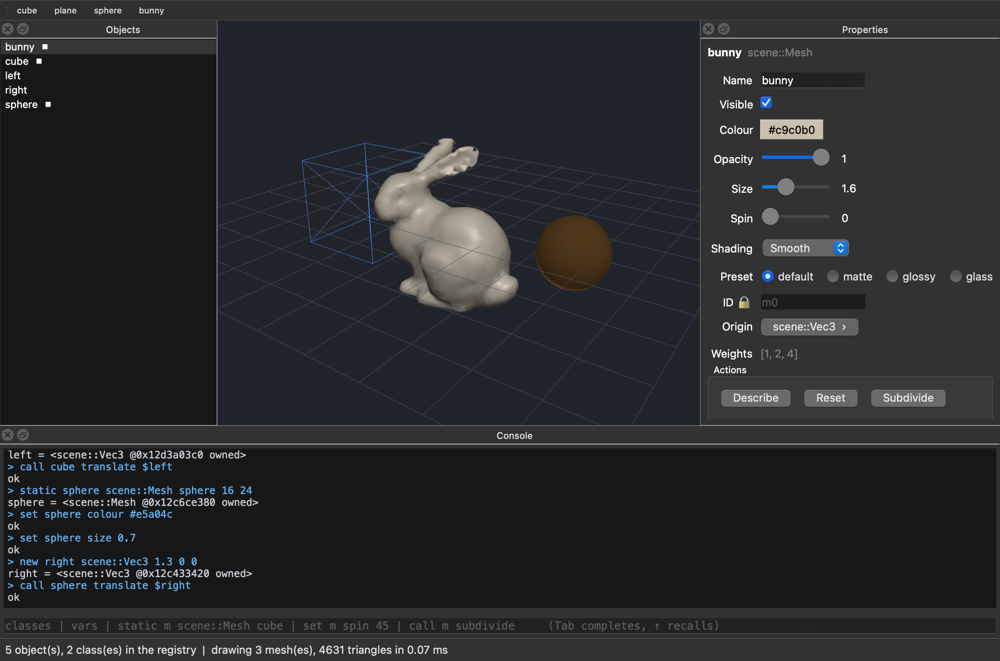

# Dynamic object model — reflection and invocation at run time

Every other rosetta backend turns your classes into calls into some framework: pybind11 `class_` registrations, N-API property descriptors, sol2 usertypes, Qt property tables. The **`dynamic`** backend turns them back into the IR — a `rosetta::dyn::MetaClass` per bound type, plus one thunk per member — so a program can ask *what exists* and *call it by name*, with no code generated for the caller.

This example binds a small stock-C++ library ([`scene.h`](scene.h)) and then drives it from front-ends that **never name a single bound type**.

There are **three consumers over one set of generated tables**, and none of them includes `scene.h`:

```bash
./run.sh            # generate (once), build, run the canned terminal session
./run.sh -i         # same, but interactive
./run.sh inspect    # the registry walker the backend emits for free
./run.sh viewer     # Qt window: 3D view + generated property panel + console
```

Stage 1 needs clang-p2996. Stage 2 — every consumer and the generated metadata — builds with a **stock C++20 compiler**, because the metadata is emitted as *data*, not as splices. The Qt target is skipped automatically if Qt 6 is not found; point at it with `-DQT_DIR=/path/to/Qt/6.x/<platform>`.

## The Qt viewer



Everything in that window was built by querying the metadata:

- **The 3D view** ([`qt/sceneview.h`](qt/sceneview.h)) walks the interpreter's variables and draws every object whose class satisfies a *geometry protocol* — `positions()` and `triangles()`, verified against the metadata (nullary, callable, returning a sequence of numbers) before anything is invoked. It then reads whatever optional appearance fields the class *happens* to have — `visible`, `colour`, `opacity`, `size`, `spin`, `origin`, `shading` — skipping any that are absent. Bind a different library with those two method names and it renders, unchanged. That is how a dynamic object model grows an interface: no base class, no registration, just a surface that matches.
- **The property panel** ([`qt/propertypanel.h`](qt/propertypanel.h)) is the terminal property sheet with real widgets. `label` → the caption, `doc` → the tooltip, `range` → the slider bounds, `readonly` → a disabled row, `combobox` → a `QComboBox`, an enum's `TypeDesc` → a `QComboBox` of its enumerators, `widget::*` → which editor when several would fit, `button` → the action row.
- **The Add menu and toolbar** ([`qt/mainwindow.h`](qt/mainwindow.h)) are built by scanning the registry for static methods that *return a drawable class* and take only numbers. `cube`, `plane` and `sphere` appear nowhere in the Qt code.
- **The console** ([`qt/console.h`](qt/console.h)) drives the same `dynui::Interp` as the terminal demo, and Tab-completes class names, variable names, and the fields and methods of whatever the variable in the current line actually holds.

The two halves stay in sync in both directions: a console command mutates an object and the view and panel re-read; a slider drag mutates an object and the view re-reads. Neither path knows what class it is touching.

```
> set cube shading Wireframe     # enumerator by name → the cube goes wireframe
> call bunny subdivide           # 3851 → 15404 triangles, redrawn immediately
> set sphere opacity 0.5         # the grid shows through the sphere
> call bunny describe
  => "bunny (13442 verts, 15404 tris)"
```

### Adding geometry costs zero UI code

The Stanford bunny in that screenshot arrived by adding **one static factory to
the library**:

```cpp
static Mesh bunny();   // scene.h, reading the tables in BunnyMesh.h
```

Nothing in `qt/` changed. It appears in the Add toolbar because that menu is
built by scanning the registry for static factories returning a drawable class;
it is reachable from the console as `static b scene::Mesh bunny`; it gets a
property panel; and it draws. That is the claim the whole example exists to
make, and it is the cheapest possible test of it.

### What it costs, measured

The bunny is also where the dynamic path stops being free. Pulling a mesh across
the boundary boxes every coordinate into an `Any` — 1889 vertices and 3851 faces
means ~17k allocations, twice, per object per frame:

| | frame time (3 meshes, 4631 triangles) |
|---|---|
| geometry re-fetched dynamically every frame | **7.51 ms** |
| geometry cached, invalidated by a cheap stamp | **0.07 ms** |

The cache is the mitigation `<rosetta/dynamic.h>` recommends, implemented:
resolve `positions` / `triangles` **once per class** (so `resolve()`'s linear
scan and overload scoring are off the hot path), then re-fetch only when
`vertexCount()` / `triangleCount()` — two scalar dynamic calls — say the mesh
changed. Appearance stays fully dynamic every frame, because it is a handful of
scalars and a slider must respond immediately.

The status bar shows the live number, so the cost is never hidden. The honest
summary: **the dynamic path is the right tool for control — properties,
commands, menus — and wants a cache in front of it for bulk data.**

`viewer --run "<cmd>" … --shot out.png` scripts that same console and writes a PNG, so the whole app is smoke-testable with nobody at the keyboard (`./run.sh shot out.png`) — the screenshot above was produced that way.

> **Enumerator names are resolved by the HOST, not the core.** `set m shading Wireframe` works because [`interp.h`](interp.h) looks the word up in the field's `TypeDesc` before dispatching. It deliberately is *not* a conversion inside `rosetta::dyn::match()`: if the core treated a string as convertible-to-enum, then `f(std::string)` and `f(Shading)` would score identically for the token `Flat`, and every such call would report an ambiguity. Name resolution is a language-binding concern; the core scores the types it was handed.

## Why this is interesting

**1. A UI built by query, not by codegen.** `demo.cpp` includes `<rosetta/dynamic.h>`, the shared [`interp.h`](interp.h), and the generated `auto_dynamic.h`. It does not include `scene.h`. It renders this by walking `registry()`:

```
+-- Mesh ------------------------------------------------------+
|  Name        textfield  "cube"
|  Visible     checkbox   true
|  Colour      color      "#4488ee"
|  Opacity     slider     1                     [0..1]
|  Size        slider     1                     [0.1..5]
|  Spin        slider     0                     [0..360]
|  Shading     combo      Smooth                {Flat|Smooth|Wireframe}
|  Preset      radio      "default"             {default|matte|glossy|glass}
|  ID          (readonly) "m0"
|  Origin      subform    <scene::Vec3 @0x11ee05f48 pinned>
|  Weights     list       [1, 2, 4]
|  Actions: [Describe] [Reset] [Subdivide]
+------------------------------------------------------------+
```

Every column comes from metadata: the label from `rosetta::label`, the editor from `rosetta::widget::*` (or inferred from the type), the bounds from `rosetta::range`, the drop-down from `rosetta::combobox` for a string field and from the *enumerators* for an enum one, the action row from `rosetta::button`. The Qt viewer above is the same function with `QWidget`s instead of `std::cout` — literally the same `widget_for()` / `label_of()` / `choices_for()` queries in `interp.h`. Add a class to the manifest and it appears in both; neither front-end changes.

**2. Annotations are enforced once, in the core** — not re-implemented per
backend:

```
> set m opacity 7
  ! opacity = 7 is outside [0, 1]
> set m id hacked
  ! Mesh::id is read-only
```

**3. Overloads come back.** `Mesh::at` has two overloads. Every name-keyed target (node, wasm, C#, Java, REST, lua) can register a name only once and drops the siblings — see [`docs/COVERAGE.md`](../../docs/COVERAGE.md). The dynamic model keeps the whole set and scores it against the actual arguments, so a miss can explain itself:

```
> call m at 1
  => 2
> call m at 1 2
  => 8
> call m at nope
  ! Mesh::at(std::string) matched no overload of 2:
    at(int) — argument 1 ("nope") is not a int
    at(int, int) — takes 2 argument(s), 1 given
```

**4. Objects are first-class arguments**, so one bound class reaches another's method with no glue:

```
> new v scene::Vec3 1 2 2
> call m translate $v
  ok
```

**5. Lifetime is explicit.** A `T&` return crosses without a copy and **pins its parent**, so a sub-object handle cannot outlive the object it points into — the gap named in [`docs/MAIN-TODO.md`](../../docs/MAIN-TODO.md) §2. The three states are distinguishable at a glance:

```
> static m scene::Mesh cube
  m = <scene::Mesh @0x11ee05ec0 owned>     # this handle keeps it alive
> call m originRef
  _ = <scene::Vec3 @0x11ee05f48 pinned>    # keeps its PARENT alive
> set _ x 10
> call m originRef
> get _ x
  => 10                                     # the write went through to the mesh
```

The Qt panel uses the same mechanism: the `Origin ›` button drills into the
nested `Vec3` with a handle that pins its `Mesh`, so editing the sub-form writes
through to the parent and the parent cannot be freed while the sub-form is open.

**6. What can't be marshalled is described, not deleted.** `Mesh::onProgress` takes a `std::function`, which has no canonical `Any` representation yet. It still appears in the metadata, with the reason, so a UI can grey it out — and it lands in `coverage.json`:

```
> methods scene::Mesh
  void onProgress(std::function<void(double)>)  -- unavailable: callback: a
      std::function parameter needs a foreign-callable adapter
> call m onProgress 1
  ! Mesh::onProgress(long long) matched no overload of 1:
    onProgress(std::function<void(double)>) — not callable: callback: ...
```

Every other backend makes such a member vanish, which looks identical to never having asked for it.

## Layout

| File | |
|---|---|
| [`scene.h`](scene.h) | the "existing library" — stock C++, never modified |
| [`Mesh.ann.json`](Mesh.ann.json), [`Vec3.ann.json`](Vec3.ann.json) | annotations, out of line, so the header stays stock ([details](../../docs/OUT_OF_LINE_ANNOTATIONS.md)) |
| [`manifest.json`](manifest.json) | targets `dynamic` (and `markdown`, for contrast) |
| [`interp.h`](interp.h) | the interpreter + the metadata queries a UI needs — **shared verbatim** by both front-ends |
| [`demo.cpp`](demo.cpp) | terminal front-end |
| [`qt/`](qt) | Qt front-end: `sceneview.h` (3D), `propertypanel.h` (widgets), `console.h`, `mainwindow.h`, `viewer.cpp` |
| [`CMakeLists.txt`](CMakeLists.txt) | builds the consumers **next to** the generated TU; the Qt target is optional |
| `bindings/dynamic/` | generated: `auto_dynamic.{h,cpp}`, `inspect.cpp`, `CMakeLists.txt` |

The consumers live *outside* `bindings/` on purpose: everything under `bindings/` is regenerated output and must never be edited, so they sit beside it and compile the generated translation unit into their own targets. Same layering as [extending a generated binding in C++](../../README.md#extending-a-generated-binding-in-c).

The split between `interp.h` and the two front-ends is the argument in miniature: the *interpreter* and the *metadata queries* are written once, and a front-end is only presentation. `demo.cpp` prints `"slider"`; `propertypanel.h` constructs a `QSlider`. Both call the same `dynui::widget_for(field)`.

## What the backend emits

For each bound type: a de-duplicated `TypeDesc` pool, `MetaField` / `MetaMethod` / `MetaCtor` arrays, and a `MetaClass` — all aggregate initializers — plus one captureless lambda per member:

```cpp
{.name = "at",
 .ret = &td_0,
 .params = k_scene__Mesh_at_1_params, .n_params = 2,
 .is_const = true,
 .overload_index = 1, .overload_count = 2,
 .invoke = +[](const ObjectRef &self, const ArgList &a) {
     return make_any(&td_0, static_cast<scene::Mesh *>(self.ptr)->at(
                                value_cast<int>(a[0]), value_cast<int>(a[1])));
 }},
```

Two details worth noticing. The thunk calls the member **by name with concrete, exactly-typed argument expressions**, so C++'s own overload resolution picks the right one — no disambiguating `static_cast` to a member-function-pointer type, which every other backend needs. And the thunk receives the whole `ObjectRef` rather than a bare `void *`, which is what makes the parent pin in point 5 expressible at all.

## Caveats

- **Per-call cost.** Name lookup plus overload scoring plus `Any` marshalling. Fine for menus, dialogs, REST routes and scripting glue; wrong for an inner loop. Cache the resolved `const MetaMethod *` per call site, and keep an expanded binding for hot paths. The Qt viewer does exactly that for its geometry — 7.51 ms → 0.07 ms per frame, [measured above](#what-it-costs-measured).
- **Not yet marshalled**, each with a distinct reason in `coverage.json`: `std::function`, `std::shared_ptr`, `std::filesystem::path`, interop (Eigen) types, foreign sequence/matrix containers, and `out_params`.
- **Parameter names** are `arg0`, `arg1`, … — rosetta does not reflect them yet (`docs/MAIN-TODO.md` §1). `ArgList` already carries optional names, so keyword arguments need no redesign once they exist. The Qt Add menu works around it by supplying positional defaults for numeric parameters.
- **Bulk data pays per element, and the cache only defers it.** Every coordinate crossing the boundary is boxed into its own `Any`, so one `positions()` + `triangles()` fetch of a 3851-face mesh is ~17k allocations. The viewer's stamp cache keeps that off the steady-state frame, but the cost returns in full whenever the geometry actually changes (`call bunny subdivide`, a shading switch), and a class exposing no cheap `vertexCount()` / `triangleCount()` counters has no stamp to check, so it is re-fetched every frame. Removing the cost — rather than deferring it — needs a batched, typed representation in `Any` itself; until then, bulk paths want a cache in front or an expanded binding beside.
- **The geometry protocol is by name.** `positions` / `triangles` is a convention this viewer picked; the *shapes* are checked against the metadata, the *names* are not. A production system would want an explicit marker — which today would mean a new annotation kind, since the lowered set (`label`, `button`, `widget`) is fixed.
- **macOS 15 + Qt**: Qt's `FindWrapOpenGL.cmake` still falls back to `-framework AGL`, which the SDK removed. `CMakeLists.txt` works around it; remove that block once Qt ships a fix.
